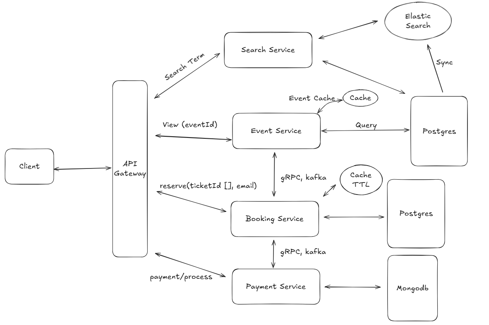

# TicketingSystem

## 🧠 System Overview

**TicketingSystem** is a microservices-based event ticketing platform built with **ASP.NET**. Each service follows **Clean Architecture** principles to ensure modularity, scalability, and maintainability.

## 🧩 System Components

### 1. **Frontend**
- Implemented using **ASP.NET MVC**.
- Interacts with the backend via the **API Gateway** using RESTful APIs.
- Responsible for rendering views and providing the user interface for searching events, booking tickets.

### 2. **API Gateway**
- Built with **Ocelot**.
- Routes incoming client requests to appropriate internal services.
- Exposes a unified RESTful API surface.

### 3. **Search Service**
- Enables users to search for events by name and description.
- Uses **Elasticsearch** for full-text search and efficient pagination.
- Synchronizes event data from **PostgreSQL** to Elasticsearch.

### 4. **Event Service**
- Provides detailed information about events.
- Retrieves data from **PostgreSQL**.
- Caches frequently accessed event data using **Redis** to improve response time.

### 5. **Booking Service**
- Handles ticket reservations: `reserve(ticketId[], email)`.
- Persists booking data in **PostgreSQL**.
- Communicates with other services via **gRPC** and **Kafka**.
- Applies **TTL-based caching** for temporary booking data using Redis.

### 6. **Payment Service**
- Manages the payment process: `payment/process`.
- Stores payment information in **MongoDB**.
- Uses **gRPC** for synchronous communication and **Kafka** for event publishing.

## 🛠 Technologies Used

| Component        | Technology                         |
|------------------|-------------------------------------|
| Frontend         | ASP.NET MVC                         |
| Backend Services | ASP.NET (Clean Architecture)        |
| Gateway          | Ocelot                              |
| Communication    | RESTful API, gRPC, Kafka            |
| Caching          | Redis                               |
| Search Engine    | Elasticsearch                       |
| Databases        | PostgreSQL, MongoDB                 |
| Messaging        | Kafka                               |

## 🔁 Inter-Service Communication
- **gRPC** is used for fast and type-safe synchronous communication between services.
- **Kafka** acts as the asynchronous message broker to handle service events and decoupling.

## 📁 Project Structure

